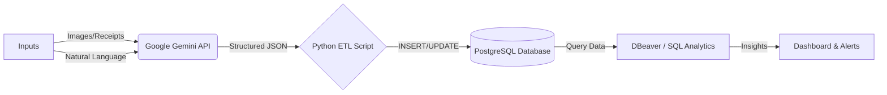

# 🥘 Smart Kitchen OS: AI-Driven Food Supply Chain


## 📖 Project Overview

**Smart Kitchen OS** is a comprehensive **Home Supply Chain Management System** designed to minimize food waste and optimize household procurement.

Unlike simple inventory lists, this system manages the full lifecycle of food—from **pantry staples** (rice, pasta, oil) to **perishables** (dairy, meat, vegetables). By leveraging **Google Gemini (Vision & NLP)**, it transforms unstructured inputs (shopping receipts, food photos, voice commands) into structured SQL data stored in **PostgreSQL**.

The goal is to automate the ETL (Extract, Transform, Load) process and utilize SQL analytics to track consumption rates, predict expiry dates, and generate smart shopping lists.

---

## 🏗️ System Architecture

The following diagram illustrates the data flow from ingestion to analysis:



### Core Components

1. **Ingestion Layer (Inbound & Outbound):**
* **Vision:** Captures grocery receipts or items via camera for bulk entry.
* **NLP:** Processes natural language commands (e.g., *"I used 200g of rice today"*).


2. **Processing Layer:**
* **ETL Pipeline:** Python scripts handle API communication and data cleaning.
* **Unit Standardization:** Converts variable inputs (e.g., "1 bag", "2 bottles") into standard units (kg, L).


3. **Storage Layer:**
* **PostgreSQL:** Serves as the central data warehouse.
* **Multi-Location Tracking:** Manages storage across *Fridge, Freezer, Pantry, and Counter*.


4. **Analytics Layer:**
* **SQL Logic:** Calculates inventory turnover, expiry risks, and restock thresholds using complex queries.


---

## 🛠️ Key Features

* **🛒 AI-Powered Inbound:** Automatically identifies item names, categories, quantities, and expiry dates from images.
* **📉 Dynamic Outbound:** Updates inventory levels based on consumption logs (SQL `UPDATE` transactions).
* **🏠 Multi-Location Support:** Manages the entire kitchen ecosystem, not just the fridge.
* **📊 Business Intelligence:**
* **Expiry Alerts:** Queries items expiring within the next 3 days (`WHERE expiry_date <= CURRENT_DATE + 3`).
* **Safety Stock:** Triggers shopping list suggestions when items fall below `min_threshold`.
* **Waste Analysis:** Tracks the financial impact of expired food (`SUM(price)` of wasted items).


---

## 🗄️ Database Schema Snapshot

Current design for the core `food_inventory` table:

| Column Name | Type | Description |
| --- | --- | --- |
| `id` | SERIAL | Primary Key |
| `item_name` | VARCHAR | e.g., "Jasmine Rice" |
| `category` | VARCHAR | e.g., Grain, Dairy, Meat |
| `location` | VARCHAR | **Fridge, Freezer, Pantry** |
| `quantity` | FLOAT | Current amount |
| `unit` | VARCHAR | Standard unit (kg, L, pcs) |
| `expiry_date` | DATE | Best before date |
| `status` | VARCHAR | IN_STOCK, CONSUMED, WASTED |

---

## 🚀 Getting Started

### Prerequisites

* Python 3.x
* PostgreSQL (Local or Docker)
* Google AI Studio API Key

### Installation

1. **Clone the repository:**
```bash
git clone [https://github.com/YOUR_USERNAME/smart-kitchen-os.git](https://github.com/YOUR_USERNAME/smart-kitchen-os.git)

```


2. **Install dependencies:**
```bash
pip install -r requirements.txt

```


3. **Setup Database:**
* Open DBeaver and connect to your local PostgreSQL.
* Run the script located in `sql/schema.sql` to create tables.


4. **Configure API Key:**
* Create a `.env` file in the root directory.
* Add your key: `GEMINI_API_KEY=your_api_key_here`


---

## 📝 Roadmap

* [ ] **Phase 1:** Database modeling & SQL constraints (Current Focus)
* [ ] **Phase 2:** Python ETL pipeline with Gemini Vision
* [ ] **Phase 3:** Natural Language Processing for inventory updates
* [ ] **Phase 4:** Advanced SQL analytics & Consumption Reporting

---

## 📄 License

This project is licensed under the MIT License.
